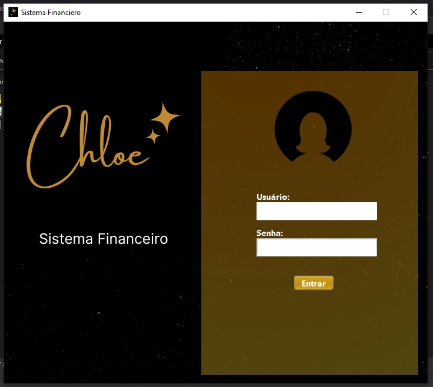
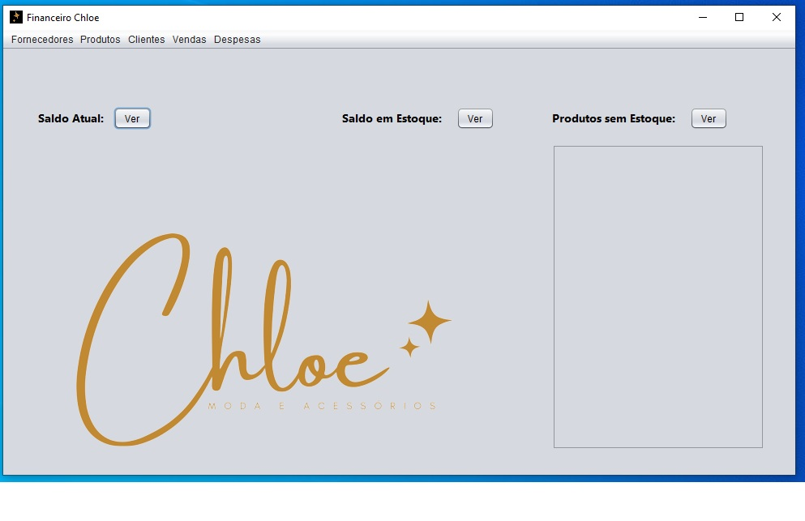
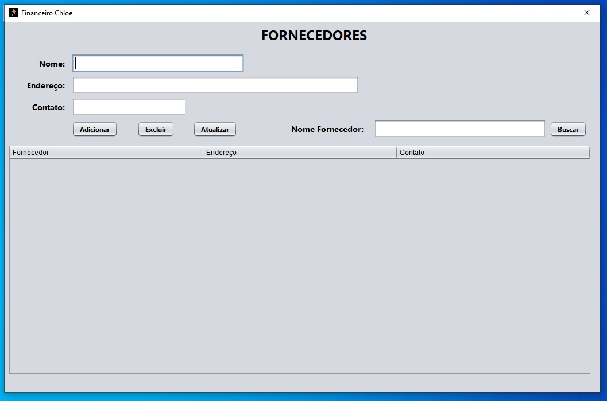
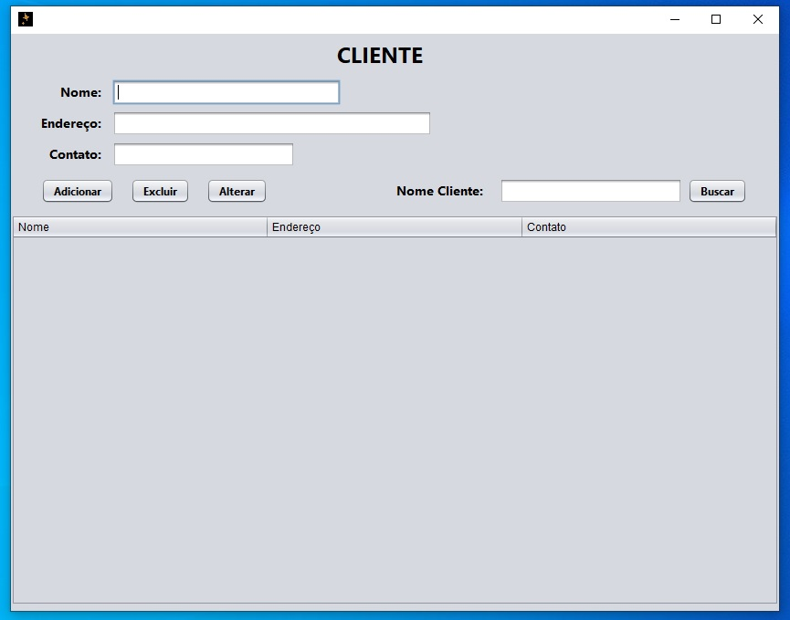
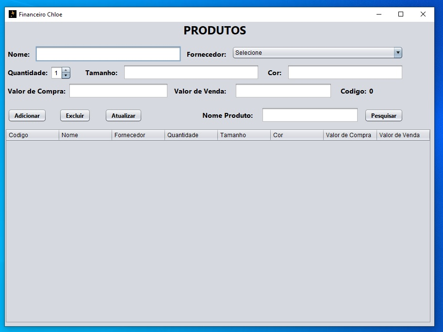
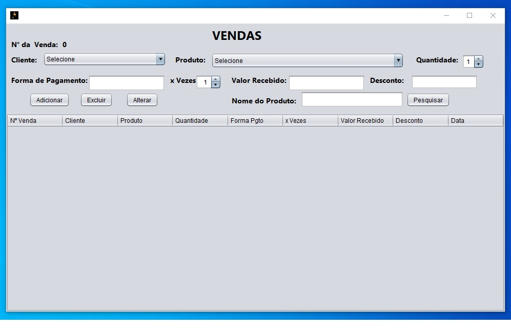
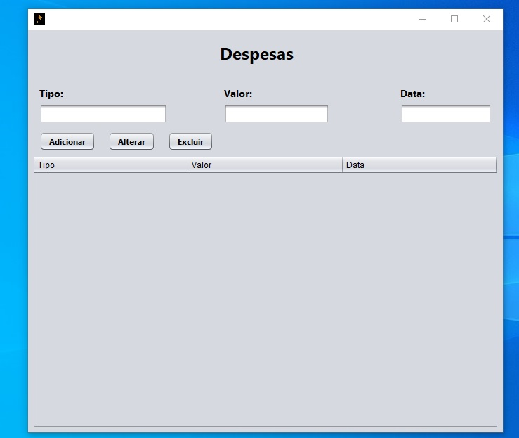
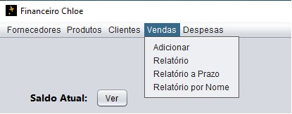
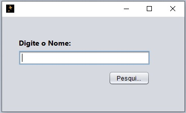

git<h1 align="center"> Aplicativo de controle Financeiro e de Estoque para Loja</h1>

Um Sistema Financeiro na linguagem JAVA com banco de dados MySQL.

  <a href="#-tecnologias">Tecnologias</a>&nbsp;&nbsp;&nbsp;|&nbsp;&nbsp;&nbsp;
  <a href="#-projeto">Projeto</a>&nbsp;&nbsp;&nbsp;|&nbsp;&nbsp;&nbsp;
  <a href="#-layout">Layout</a>&nbsp;&nbsp;&nbsp;|&nbsp;&nbsp;&nbsp;
  <a href="#memo-licença">Licença</a>

  

 

  

## 🚀 Tecnologias

Esse projeto foi desenvolvido com as seguintes tecnologias:

- [JAVA](https://www.java.com/pt-BR/)
- [MySQL](https://www.mysql.com/).github
- [iText](https://itextpdf.com/)

## 💻 Projeto

Um Sistema Financeiro na linguagem JAVA com banco de dados MySQL para uma empresa de moda. O mesmo consiste não somente em catalogar as vendas, mas também tem a funcionalidade de gerenciamento de estoque e despesas.

## 🔖 Layout

  

  

  

  

  

  

  

  

## :memo: Licença

Esse projeto está sob a licença MIT.

---